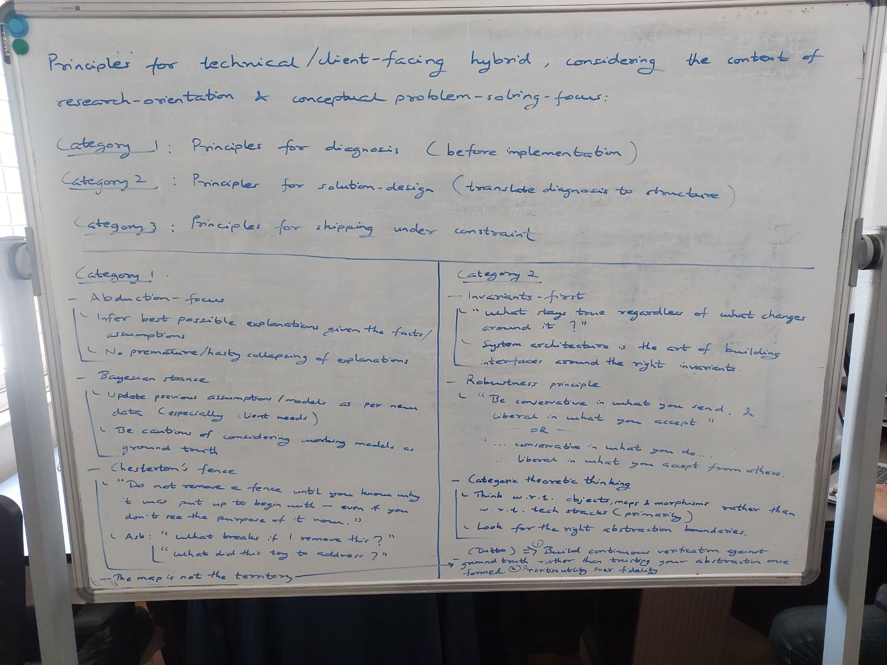

<h1>Principles for a Technical/Client-Facing Hybrid</h1>

***Leveraging a research-orientation and conceptual-problem-solving focus for FDE work***

> **AI prompts used for Claude Sonnet 4.6 to obtain responses**

Click here to see prompt 1

I have a weird question. I have substantial experience in doing project-level research, conceptual problem-solving, along with a background in computer science, mathematics and statistics. Most of the projects I've been involved in have been ground-up research-heavy implementation. Now, I want to get into the area of forward-deployed engineers. However, the idea of doing a step-by-step course in DSA, front-end, back-end, etc. bores me, especially as I have various bits and pieces of these already committed to my memory and skillset. Can I use my inclination toward research and conceptual problem-solving + a general background in computer science, mathematics and statistics as well as AI (model-building, training, procedural generation, etc., mostly in academic settings) to progress toward an FDE in a way that uniquely leverages my skillset and background without boring me to death?

Click here to see prompt 2

<i>(After the response following prompt 1)</i>
  
What about certain principles that would help me and leverage my strengths and/or fill gaps in my capabilities? Because I've seen that just getting into problems head-on may give you a lot of hands-on experience, but it cannot substitute the rigour and grassroots-level strength and stability a principled approach can. No need to be conventional about this. We can explore principles that may not seem relevant to computer science at all, e.g. cognitive principles, mathematical ideas, philosophical frameworks, epistemology, etc.. But you can be conventional if you want of course, no constraint there.

> **Whiteboard**:

Click here to see the whiteboard

---

**Contents**:

- [Category 1: Principles for Diagnosis](#category-1-principles-for-diagnosis)
  - [Abduction-focus](#abduction-focus)
  - [Bayesian stance](#bayesian-stance)
  - [Chesterton's Fence](#chestertons-fence)
  - [The map is not the territory](#the-map-is-not-the-territory)
  - [Category 2: Principles for Solution Design](#category-2-principles-for-solution-design)
  - [Invariants-first](#invariants-first)
  - [Robustness principle (Postel's Law)](#robustness-principle-postels-law)
  - [Category-theoretic thinking](#category-theoretic-thinking)
- [Category 3: Principles for Shipping Under Constraint](#category-3-principles-for-shipping-under-constraint)
  - [Worse-is-better (New Jersey style over MIT style)](#worse-is-better-new-jersey-style-over-mit-style)
  - [Second-system effect](#second-system-effect)
  - [OODA loop (Observe - Orient - Decide - Act)](#ooda-loop-observe---orient---decide---act)
  - [Preregister your hypothesis before you dig](#preregister-your-hypothesis-before-you-dig)
- [The Connective Tissue](#the-connective-tissue)

---

# Category 1: Principles for Diagnosis
> Before implementation - understanding the problem before touching a solution.

## Abduction-focus
- Infer the best possible explanation given the facts/assumptions available.
- No premature/hasty collapsing of explanations   - *hold multiple candidate models before committing to one.*

> **Stopping rule**: Collapse to a single explanation once the cost of running another disconfirming test exceeds the cost of being wrong. Without this, rigor turns into infinite regress - and it will fight against the Category 3 principles (worse-is-better, ship under constraint) instead of complementing them.

## Bayesian stance
- Update prior assumptions/models as new data comes in   - *especially client needs, which shift as the engagement progresses.*
- Be cautious of treating a currently-working model as ground truth.
    > This model is a live hypothesis, not a fact.

## Chesterton's Fence
- "Do not remove a fence until you know why it was put up to begin with   - *even if you don't see the purpose of it now.*"
- Ask: *"What breaks if I remove this?"* and *"What did this try to address?"*
- Legacy weirdness in a client's system can be load-bearing.

## The map is not the territory
- Your model of the client's domain, however good, is not the domain itself.
- **Bridges into Category 2**:
  - Build continuous verification against ground truth
  - Do not just trust your abstraction once it is formed.

> **Key corollary**: *Prioritize utility and legibility over fidelity.* This is the key adjustment for a research-oriented mind: the instinct is to increase model fidelity, but in client work, a model the client and your teammates can understand and trust often matters more than another decimal of accuracy.

## Category 2: Principles for Solution Design
> Translating diagnosis into structure.

## Invariants-first
- Ask: *"What stays true regardless of what changes around it?"*
- System architecture is the art of building interfaces around the right invariants   - *not the art of picking a tech stack.*

## Robustness principle (Postel's Law)
- "Be conservative in what you send, and liberal in what you accept."
- 2 readings worth holding, as FDE work often puts you on both sides of an integration:
  - Conservative in what you *send* / liberal in what you *accept*.
  - Conservative in what you *do* / liberal in what you *accept from others*.

## Category-theoretic thinking
- Think in terms of objects, maps, and morphisms, not primarily in terms of tech stacks.
- Look for the right abstraction boundaries
  - The question is not "what's the right tech stack?"
  - The question is "what's the right set of objects and the mappings between them?"

# Category 3: Principles for Shipping Under Constraint
> Where research-orientation can work against you if left unchecked.

## Worse-is-better (New Jersey style over MIT style)
- Pragmatic, slightly-imperfect solution that ships > Elegant, complete one that does not.
- Practice stopping at "good enough, verified."

## Second-system effect
- Watch for the temptation to over-design once a working version 1 exists.
- A common failure mode for structural thinkers:
    > Once the shape of the "proper" architecture becomes visible, there is a pull to build it prematurely, before it is earned.

## OODA loop (Observe - Orient - Decide - Act)
- FDE work is a live iteration loop, often with the client in the room.
- The discipline is compressing the loop, not perfecting any single pass through it.

## Preregister your hypothesis before you dig
Before digging into a client's logs/data to diagnose an issue: *write down what you expect to find first.* This guards against confirmation-bias-ing your way into a diagnosis that fits whichever data you happened to look at first - a real risk for someone skilled at building plausible narratives.

# The Connective Tissue
The 3 categories are not sequential stages so much as a loop: Category 1 (diagnosis) feeds Category 2 (design), which gets stress-tested in Category 3 (shipping), which generates new diagnostic signal that loops back into Category 1. The two bridge principles - *the map is not the territory* and its corollary, *prioritize legibility over fidelity* - are what keep that loop honest over time rather than letting any one stage calcify into unquestioned ground truth.

> The single biggest calibration for a research-heavy background: research-orientation rewards depth and completeness; FDE work rewards a fast, well-instrumented loop. The principles above are not a replacement for rigor, but rather, they are rigor redirected at the right target: the loop itself, not any single pass through it.